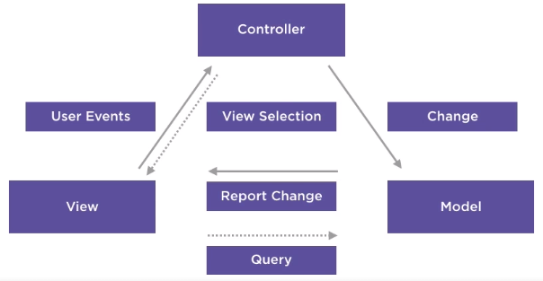
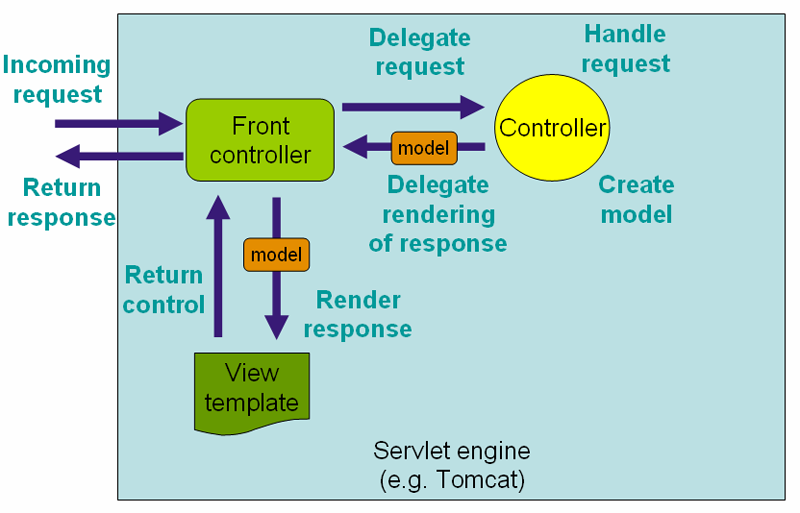
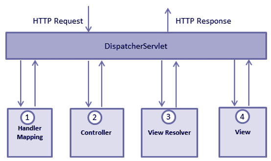

# Spring MVC

Examples:
- [Greeting](http://localhost:8080/conference/greeting)
- [Registration](http://localhost:8080/conference/registration)

## Vocabulary

- SPA: Single Page Application
- DispatcherServlet: Entry point into the application
- Controller: Command Pattern Handler
- RequestMapping: URL and Request Type
- ViewResolver: Locates View to serve
- Servlet-config: Configuration file (Can also be done using java configuration)
- POJO: Plain Old Java Object
- Bean: Spring configured POJO

## Configuration

- pom.xml (dependencies)
- Config (XML or Java)
- Java (Controller, Model, Configuration etc.)
- View

## Model - View - Controller

## Application Layers

- Presentation Layer
- Business Logic
- Data Layer

## Components

- Controller
- Service
- Repository

## DispatcherServlet

The Application class extends SpringBootServletInitializer which tells the application server to create a DispatcherServlet.

The @SpringBootApplication annotation contains:
- @EnableAutoConfiguration
- @ComponentScan
- @Configuration

Because of the @Component scan the application will pick up on our controllers annotated with @Controller.

## Interceptors

- Logging
- Security
- I18N
- Performance Monitoring