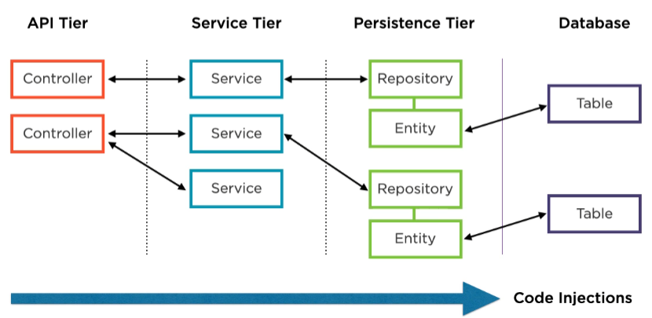
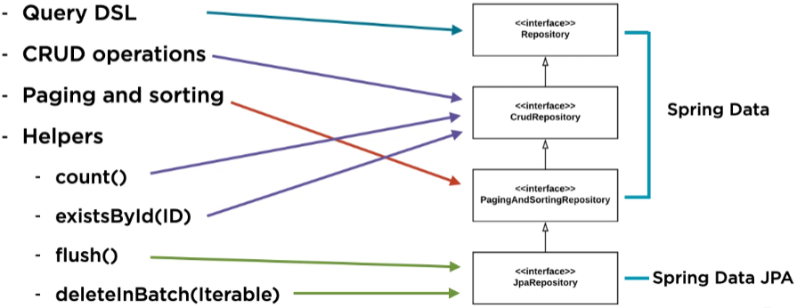

# Spring Data JPA

- Reduces our data access code
- Provides us with query flexibility
- Boosts and enhance data models
- Gives us enterprise level features

## Dependencies

Spring Boot project:
```xml
<!-- Everything you need for Spring Data JPA -->
<dependency>
	<groupId>org.springframework.boot</groupId>
	<artifactId>spring-boot-starter-data-jpa</artifactId>
</dependency>
<!-- Postgres JDBC driver (or driver for any db you want to use) -->
<dependency>
	<groupId>org.postgresql</groupId>
	<artifactId>postgresql</artifactId>
	<scope>runtime</scope>
</dependency>
```

These dependencies will be replacing:
```xml
<!-- JPA spec implementation -->
<dependency>
	<groupId>javax.persistence</groupId>
	<artifactId>javax.persistence-api</artifactId>
</dependency>
<!-- JPA implementation provider -->
<dependency>
	<groupId>org.hibernate</groupId>
	<artifactId>hibernate-enitiymanager</artifactId>
</dependency>
<!-- JPA transaction Manager and Local Entity Manager in Spring -->
<dependency>
	<groupId>org.springframework</groupId>
	<artifactId>spring-orm</artifactId>
</dependency>
<!-- Postgres JDBC driver -->
<dependency>
	<groupId>org.postgresql</groupId>
	<artifactId>postgresql</artifactId>
	<scope>runtime</scope>
</dependency>
```

## Why Data JPA

Data JPA simplifies the persistence layer:
- Configuration
  - Spring beans
    - DataSource
    - TransactionManager
    - ...
  - Mapping entities to db tables
  - Defining CRUD operations for entities

What is left to write:
```java
public interface SomeRepository extends JpaRepository<Some, Long> { }
```

## What is Spring Data JPA

- Enhances JPA
- Simplifies the Data Tier
- Interface that implements CRUD: JpaRepository
- Uses Query Domain Specific Language
- Offers often used data tier features
  - Paging
  - Sorting
  - ...
- Follows a 'use where needed' philosophy

## What is JPA

Java Persistence API is an ORM-tool that maps relation database structure to java objects.

## @Repository Stereotype

- One of Springs core stereotypes: Indicates that an annotated class is a "Repository",
originally defined by Domain-Driven Design as "a mechanism for encapsulating storage,
retrieval, and search behavior which emulates a collection of objects".

- A class thus annotated is eligible for Spring DataAccessException translation when used in 
conjunction with a PersistenceExceptionTranslationPostProcessor. The annotated class is also
clarified as to its role in the overall application architecture for the purpose of tooling, aspects, etc.

- As of Spring 2.5, this annotation also serves as a specialization of @Component,
allowing for implementation classes to be autodetected through classpath scanning.

## Repository Architecture

- Persistence contract
- DAO pattern (In the pure form they use an interface, but it can also be classes)



## Differences Standard Repository

Differences between Spring Data JPA Repository & Standard Repository:
- Java interface, not class (with 1 exception)
- Map 1 to 1 with JPA entity (implemented through java generics)
- Focus on DAO contract

```java
public interface SomeJpaRepository extends JpaRepository<Some, Long> { }
```

*With Spring Data JPA, we don't have to implement the interface.*

## JpaRepository Hierarchy

- Interface: Repository
- Interface: CrudRepository
- Interface: PagingAndSortingRepository
- Interface: JpaRepository

Functionalities:
- Query DSL
- CRUD operations
- Paging and sorting
- Helpers
  - count()
  - existsById(ID)
  - flush()
  - deleteInBatch()

