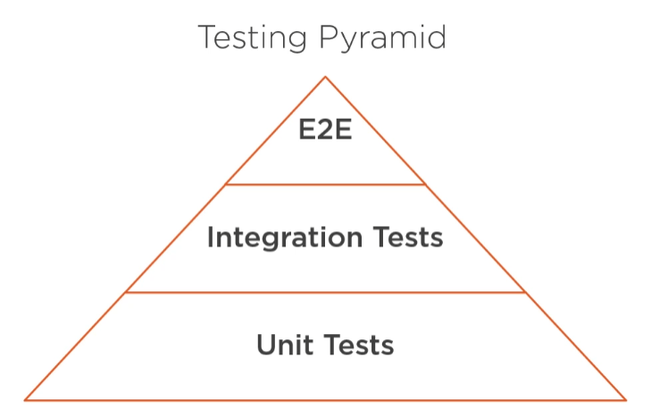

## Testing

- Integration testing for the Data Access Layer
- Creating Mongo integration tests



### Why

- Data is at the core of most enterprise software applications
- Graceful handling of edge cases
- Easy tom accomplish in Spring

### Test Flow

- Setup data in the db
    - Fire up test suite
    - Start embedded MongoDB in memory / connect to actual DB
    - Populate collection(s) with test data
- Execute SUT (System Under Test / DB operation)
- Assert result
- Empty DB

*Tests should be predictable. If the data in the DB is volatile, our tests will be flaky.*

### What To Test

- Complex queries (String, complex criteria, Projections)
- Object <> Document mapping (Especially custom ones)
- Lifecycle events

### In Spring

- Embedded
    - Pro
        - No dependencies needed
        - Integrates easily with CI/CD pipelines
        - Faster Tests
    - Con
        - Not an official Mongo product
        - Not "quite" integration testing
- Standalone
    - Pro
        - Better reflects production environment
    - Con
        - Needs a dedicated Mongo database
        - Increased set-up complexity for CI/CD
        - Slower tests

### @DataMongoTest

Annotation that can be used for MongoDB test that **focuses only on MongoDB components**.
Using this annotation will disable full auto-configuration and instead apply configuration relevant to MongoDB tests.

### Embedded Dependency

```xml
<dependency>
    <groupId>de.flapdoodle.embed</groupId>
    <artifactId>de.flapdoodle.embed.mongo</artifactId>
    <scope>test</scope>
</dependency>
```

### Embedded Example

```java
@DataMongoTest
@ExtendWith(SpringExtension.class)
@Category("integration")
class DatabaseIntegrationTests {
    @Autowired
    MongoTemplate mongoTemplate;

    @BeforeEach
    public void beforeEach() {
        mongoTemplate.insertAll(aircraft);
    }

    @AfterEach
    public void afterEach() {
        mongoTemplate.dropCollection(Aircraft.class);
    }

    @Test
    public void findByMinAircraftNbSeatsShouldWork() {
        List<Aircraft> result = mongoTemplate.findAll(Aircraft.class);
        assertEquals(3, result.size());
    }
}
```

### Test Configuration

```java
@TestConfiguration
public class TestConfiguration {
    @Bean
    public MongoDbFactory mongoDbFactory() throws Exception {
        return new SimpleMongoClientDbFactory("<test-db-mongouri>");
    }

    @Bean
    public MongoTemplate mongoTemplate(MongoDbFactory factory) {
        return new MongoTemplate(factory);
    }
}
```

### Integration Example

```java
@DataMongoTest
@ExtendWith(SpringExtension.class)
@Category("integration")
@Import(TestConfiguration.class) // <---
class DatabaseIntegrationTests {
    @Autowired
    MongoTemplate mongoTemplate;

    // ...
}
```