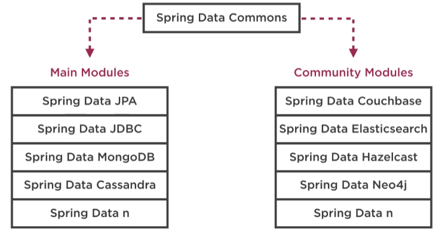

# Spring Data Overview

## Why

*Different databases have different data access libraries. Using Spring data our code will look much more similar.*

A lot of supported libraries:
- JPA
- MongoDB
- Cassandra
- ...

Abstractions:
- CRUD
- Derived queries
- Transactions
- Paging and Sorting
- Auditing
- ...

## Benefits

- Consistent programming model
  - Same abstractions for all modules
  - Rarely touch underlying libraries
  - Easy to learn additional modules
- Reduction in Boilerplate
- Integrates easily into Spring Boot

## Module Hierarchy



## Spring Data Commons

### CRUD Repository

Marker interface:
```java
public interface CustomerRepository extends CrudRepository<Customer, Long> { }
```

### Deriving Queries

Method signature:
```java
List<Customer> findByName(String name);
```
Derived query:
```java
entityManager.createNativeQuery(
    "SELECT * FROM customers WHERE name = 'Steven' = ?")
      .setParameters(1, origin)
      .getResultList();
```

Benefits:
- No boilerplate
  - Generated for us
  - Executed for us
  - Mapped for us
- Easy learning curve
  - No need to write native query
  - Easy to swap implementations

## Paging & Sorting

```java
Page<Customer> findByName(String name, Pageable pageable, Sort sort);
```