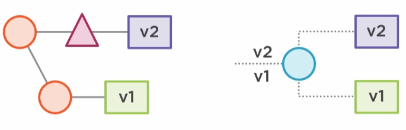

# API Versioning

## Good Practices

- Group breaking changes into a single release
- Only use major versions, minor versions shouldn't include breaking changes
- Set end-of-life date for previous versions

## Anti-Patterns

- Versions in class name / entity (ClassV1, ClassV2, ...)
- Mapping out all CRUD methods (maintenance increase)

## Strategies

### URI Versioning

*Define vendor specific URI.*

- PROS
    - Simple to implement
    - Version is embedded in URI (Usually near root)
    - Works with caching where URI is key
- CONS
    - Creates whole new tree with each version
    - URI changes for newest version

Example:
- http://yourdomain.com/api/v1/products
- http://yourdomain.com/api/v2/products

### Media Type

*Define vendor Specific media types.*

- PROS
    - URI doesn't change
- CONS
    - Non-standard media types can be confusing

Example:
- Accept: application/vnd.yourdomain.v1+json
- Accept: application/vnd.yourdomain.v2+json

### Custom header

*Use a custom header to define vendor specific values.*

- PROS
  - URI doesn't change
  - More clear than non-standard media type

Example:
- Accept-version: v1
- Accept-version: v2

### Request parameter

*Define vendor specific parameters.*

- PROS
  - URI doesn't change
- CONS
  - Routing can be more difficult/annoying

Example:
- http://yourdomain.com/api/products?version=v1
- http://yourdomain.com/api/products?version=v2

### No strategy

*Define no vendor specific version.*

- PROS
  - No 'v1' in URI
  - Simple server logic
  - Client doesn't need to know any special header info
  - If a new version is ever needed, add it only then
    - Existing API can become the 'old' default when no version is specified

## Most Popular

- URI versioning
- Custom header

*Using either of these will promote people understanding our API versioning system.*

## Base Path

To add a suffix to the base path for all Spring Data managed endpoints:
```properties
spring.data.rest.basePath=/v2
```

When endpoints aren't managed by Spring Data:
```java
@BasePathAwareController
@RestController
public class ExampleController {
    @RequestMapping("/schedule")
    public String getSchedule(){
        // ...
    }
}
```

## Branching & Load Balancer

*Use existing framework functionality to make your life easier.*



Advantages:
- Artifact per version
- Leverage tools
- Repeatable pattern

*Deploy both branched versions on different ports & use the loadbalancer.*

*In the case of using URI, define forwarding rules depending on the path.*

*In the case of using custom headers, define these in the loadbalancer instead of the project, and forward accordingly.
Consider customizing a fixed 404 response when the custom header wasn't found to remind users of them.*